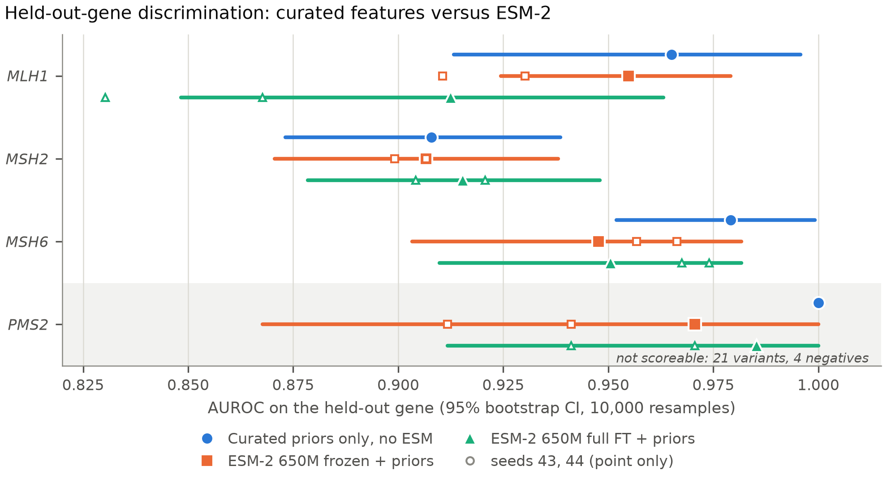
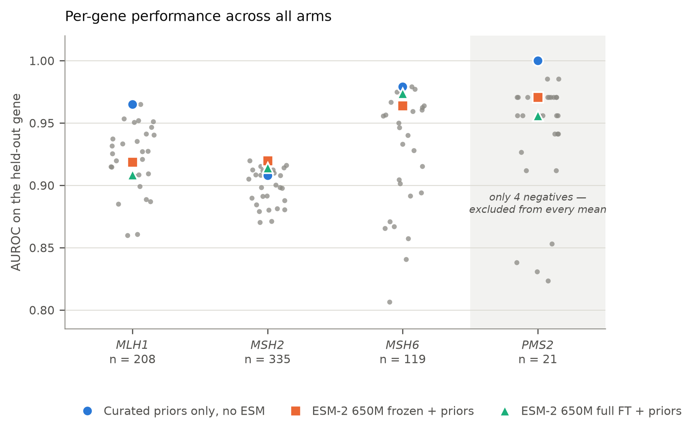
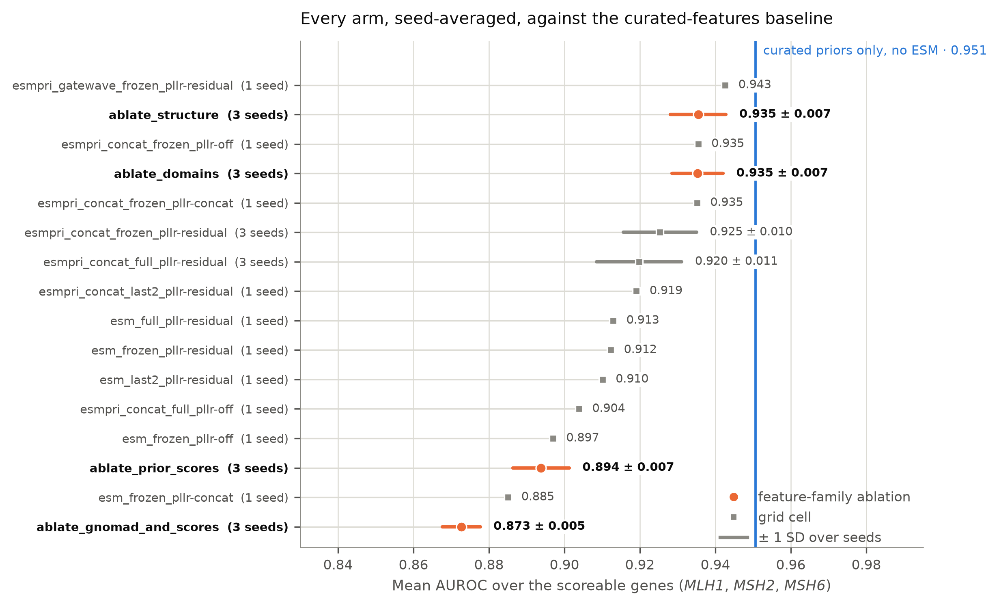

# Title options

1. **Concise** — Merging heterogeneous variant evidence for missense pathogenicity prediction in the DNA mismatch repair genes

2. **Technical** — A leakage-controlled evidence-integration pipeline for missense pathogenicity: variant-level source merging, label-conflict quarantine, and leave-one-gene-out evaluation of frozen and fine-tuned ESM-2 representations

3. **Clinically oriented (non-overclaiming)** — Held-out-gene evaluation of protein language model and curated-feature classifiers for missense variants in MLH1, MSH2, MSH6 and PMS2: a research benchmark, not a diagnostic

---

# Abstract

**Background.** Most missense variants observed in clinical sequencing are variants of uncertain significance. Computational prediction could help prioritise them, but published accuracy figures are difficult to interpret. Evidence for a variant is scattered across clinical archives, deep mutational scanning (DMS) assays, population frequency databases, structural models and precomputed prior scores, and these sources disagree, overlap, and in several cases encode the target label. Reported performance is frequently obtained under random splits, which allow variants from the same gene — and often the same residue — to appear in both training and test data.

**Methods.** We assembled a variant-level evidence table for the four DNA mismatch repair (MMR) genes *MLH1*, *MSH2*, *MSH6* and *PMS2*, keyed strictly on `(uniprot_id, position, wt_aa, mut_aa)` with the canonical UniProt sequence as the sole coordinate authority. The row universe is the union of all possible missense substitutions rather than any single source, and every source is attached by validated left join. Labels are resolved only after merging, under an explicit precedence (ClinVar ≥2-star, then ProteinGym clinical, then eligible single-assay DMS proxy); variants with within-source or cross-source label conflicts are quarantined rather than coerced, and variants of uncertain significance are never used as training labels. Models were evaluated by leave-one-gene-out (LOPO), with thresholds selected on an inner validation fold only. We ran a 16-cell ablation grid over backbone freeze depth, feature branch, PLLR mode and fusion, at three seeds for the primary comparison, together with a curated-feature baseline carrying no language-model input and four feature-family ablations run at three seeds each, at the frozen `esm+priors` cell with every other setting held identical.

**Results.** The merged MMR table contains 74,328 variants (3,912 residues × 19 substitutions), of which 683 carry clinical labels usable for supervision (443 ClinVar, 240 ProteinGym clinical). The grid completed 16/16 cells in 17.84 h with no failures. Holding the feature set fixed, full fine-tuning of the 650M-parameter backbone did not improve ranking over a frozen backbone (ΔAUROC −0.005, ΔAUPRC −0.002 across three seeds), while adding 27 curated prior features to the frozen model raised AUROC by 0.031. Full fine-tuning did shift the operating point substantially (accuracy 0.733 → 0.840, recall 0.732 → 0.872, specificity 0.809 → 0.775, Brier 0.182 → 0.150). Threshold selection on the inner validation fold outperformed a fixed 0.5 cut by only 0.011 accuracy and was worse in 6 of 16 cells. Calibration was poor throughout (ECE ≈ 0.19–0.20). *PMS2* could not be scored: its held-out set has 21 variants with 4 negatives. A curated-feature head with no language-model input scored 0.9507 mean AUROC over the three scoreable genes — above every cell in the grid, including those reading the same 27 features. Feature-family ablations, at three seeds each, localised the curated contribution: removing the 18 external prior-score columns (AlphaMissense, zero-shot scores, rank transforms) cost 0.032 AUROC and removing them together with gnomAD cost 0.053, while removing structural or domain features changed the mean by +0.010, within seed noise and in the wrong direction to be a contribution.

**Conclusions.** For this cohort, the informative axis is the feature set, not backbone freeze depth; a 6.5-point gap previously attributed to freeze depth is attributable to the feature set once the two are separated. The protein language model did not earn its place: curated features alone rank better than any configuration that adds ESM-2, and most of that curated signal is itself inherited from other predictors rather than from structural or domain evidence. The threshold-transfer protocol loses roughly 0.1 accuracy under leave-one-gene-out and is the most tractable target for improvement. Absolute performance rests on 683 clinical labels across four genes and should not be read as evidence of clinical utility.

**Keywords.** missense variant; pathogenicity prediction; data integration; label conflict; leave-one-gene-out; protein language model; calibration; ablation.

---

# 1. Introduction

Clinical sequencing returns far more missense variants than can be interpreted. In hereditary cancer panels the dominant output is the variant of uncertain significance (VUS), which by definition cannot guide management. Computational predictors are attractive because they scale, and several are now embedded in variant-curation workflows. The difficulty is deciding what a reported accuracy figure actually means.

Three problems recur.

First, the evidence for a variant is distributed across sources with different semantics. A clinical archive records asserted significance with a review status. A deep mutational scanning experiment records a continuous fitness measurement under one assay in one cell type. A population database records how often an allele is observed. A structure predictor records a per-residue confidence. Precomputed pathogenicity scores record another model's opinion. These are not interchangeable, and combining them requires deciding which are evidence, which are features, and which are labels.

Second, several of these sources are label-adjacent. Population allele frequency is used as a benignity criterion in clinical classification guidelines; if allele frequency both defines benign labels and enters the feature matrix, a classifier can recover the label by construction. Precomputed scores such as AlphaMissense were themselves trained on population and clinical data, so using them as features while evaluating against clinical labels risks measuring agreement with an upstream model rather than agreement with biology. These are not hypothetical failure modes; they are the default outcome of naive merging.

Third, and most consequentially for reported numbers, the evaluation split determines what is being measured. Under a random split, variants at the same residue of the same protein routinely appear on both sides. Because a protein language model encodes local sequence context, and because curated features such as domain membership are constant within a region, the model can score a held-out variant using information from its neighbours. The resulting figure describes interpolation within known genes, not generalisation to a new gene. Held-out-gene evaluation is stricter and much less flattering, and is the only split under which a claim about a previously uncharacterised gene has meaning.

This work addresses the merging and evaluation problem for the four DNA mismatch repair genes associated with Lynch syndrome. The gene set is small and deliberately so: it is well characterised, has a substantial ClinVar record, carries a large DMS dataset for *MSH2*, and includes *PMS2*, whose pseudogene homology makes short-read variant calls unreliable over part of the coding sequence and therefore forces an explicit exclusion policy rather than a silent one.

Our contributions are:

1. A variant-level merge protocol with a single identity key, canonical-sequence validation of every wild-type residue, union-based row construction, and per-source provenance, implemented so that a merge cannot silently drop or duplicate a variant (Section 2.2).
2. An explicit label-resolution policy with source precedence, documented DMS direction mapping, and quarantine — rather than coercion — of contradictory evidence (Section 2.3).
3. A leakage-controlled evaluation protocol using leave-one-gene-out as the primary split, with residue-group-disjoint inner folds and validation-only threshold selection (Section 2.6).
4. A 16-cell ablation grid that separates backbone freeze depth from feature set, two factors previously confounded in this project's own earlier analysis (Sections 2.7 and 3.5).
5. An honest account of what this cohort cannot support, including a held-out gene that is too small to score and a threshold protocol that transfers poorly across genes (Sections 3.4, 3.6 and 4).

---

# 2. Materials and Methods

## 2.1 Data sources

All sources below were used to build the MMR panel described in this manuscript. Access is via the URLs recorded in the build manifest (`data/mmr/processed/extended/manifest.json`), which stores a SHA-256 checksum for each downloaded file.

**ClinVar.** Tab-delimited `variant_summary.txt.gz` from the NCBI FTP archive, SHA-256 `186ad283…529804c9`. Contributes clinical labels. Only assertions with a review status of two stars or more were eligible for supervision (`min_stars = 2`). Variants of uncertain significance were retained in the table with their review metadata for prospective scoring, but never used as labels.

**ProteinGym v1.3 (DMS substitutions).** Obtained from the Harvard mirror and Zenodo record 15293562; `DMS_ProteinGym_substitutions.zip` SHA-256 `3a837662…6473b921` (43,021,128 bytes) and `DMS_substitutions.csv` SHA-256 `a8f49801…049b308` (208,734 bytes). Contributes continuous fitness scores and an assay-binarised label. One assay covers the panel.

**ProteinGym v1.3 (clinical benchmark and zero-shot scores).** `clinical_ProteinGym_substitutions.zip` SHA-256 `afe711af…4ce37be4` and `zero_shot_clinical_substitutions_scores.zip` SHA-256 `6ae0dd2c…eadf0aeb`. Contributes a secondary clinical label source and precomputed zero-shot model scores.

**AlphaMissense** v1.0 (2023-09-18 release), `AlphaMissense_aa_substitutions.tsv.gz`, licence CC BY-NC-SA 4.0. Contributes a precomputed pathogenicity prior. Note the non-commercial licence term.

**gnomAD v4** via the public GraphQL API (`gnomad_r4`). Contributes variant-level allele frequencies and gene-level constraint metrics (pLI, o/e LoF, o/e missense, missense Z, synonymous Z).

**UniProt.** REST endpoint `https://rest.uniprot.org/uniprotkb/{acc}.json`. Provides the canonical sequence — the coordinate authority for the entire table — plus domain intervals and point functional-site annotations.

**AlphaFold DB** via `https://alphafold.ebi.ac.uk/api`, licence CC-BY-4.0. Contributes per-residue pLDDT.

**InterPro** via `https://www.ebi.ac.uk/interpro/api`, licence CC0. Contributes domain, family and superfamily intervals.

**MaveDB and CIMRA/OddsPath.** Adapters exist in the codebase (`src/mavedb.py`, `src/cimra.py`) and are exercised by the test suite. `[TODO: confirm whether MaveDB and CIMRA contributed any rows to the MMR build reported here — the build manifest records no MaveDB or CIMRA source block, which indicates they were not enabled. If they were not, state this explicitly in Table 1 rather than omitting the rows.]`

### Table 1 — Data source summary (MMR panel)

Counts are taken from `manifest.json → stats` for the build dated 2026-09-03T15:51:39Z unless noted.

| Dataset | Role | Raw records | Retained on panel | Mapping | Contribution | Used in |
|---|---|---|---|---|---|---|
| ClinVar (≥2★) | Clinical label | `[TODO: total rows in variant_summary.txt.gz]` | 464 labelled; 9,589 VUS retained unlabelled | HGVS p. → UniProt coords, wt validated | Label (precedence 1) | Train + eval |
| ProteinGym DMS v1.3 | Functional assay | 329,664 human rows | 16,749 panel rows; 1 assay | UniProt coords | Label (precedence 3), feature | Not used for supervision here |
| ProteinGym clinical v1.3 | Clinical label | 62,727 rows | 564 joined | RefSeq NP → sequence match | Label (precedence 2) | Train + eval |
| Zero-shot scores v1.3 | Prior score | — | 564 joined | UniProt coords | Feature | Train |
| AlphaMissense v1.0 | Prior score | — | 74,328 | UniProt coords | Feature | Train |
| gnomAD v4 | Population frequency | — | 6,492 with joint AF; constraint on 74,328 | Protein substitution | Feature | Train |
| UniProt | Coordinate authority, annotation | — | 4 accessions; 20 domain intervals; 61 site rows | — | Feature + key | Train |
| AlphaFold DB | Structure confidence | — | 3,912 residues, 4 accessions | Accession + position | Feature | Train |
| InterPro | Domain/family | — | 123 intervals; 72,599 rows in a domain | Accession + position | Feature | Train |
| MaveDB | Functional assay | `[TODO]` | `[TODO — likely 0, not enabled]` | — | — | — |
| CIMRA / OddsPath | Calibrated evidence | `[TODO]` | `[TODO — likely 0, not enabled]` | — | — | — |

**A provenance defect found and corrected during preparation of this manuscript.** As originally written, the MMR manifest described the table as it existed *before* gnomAD was joined. It recorded `parameters.include_gnomad: false` with `gnomad_rows_panel: 0`, and — more seriously — an artefact checksum of `63fd5288…` at 37,862,375 bytes for a file that was by then `78eb5d60…` at 48,522,869 bytes.

The cause was pipeline ordering. `src/extended_builder.py` writes the manifest immediately after writing the table; `scripts/build_mmr_dataset.py` then reads that table back, joins gnomAD allele frequencies and gene constraint in its stages 3 and 4, and rewrites the file. The manifest was not re-stamped. The data were correct throughout; the provenance record was not.

We record this because a checksum that does not match the file it names is worse than no checksum: it invites a reader to trust it. The builder now re-stamps the manifest after any post-hoc modification (`extended_builder.refresh_manifest`), and `scripts/repair_manifest.py` corrects manifests from earlier builds in place by measuring the table rather than trusting the recorded flags. The manifest accompanying the results reported here has been repaired, and its recorded digest for `extended_dataset.csv` now matches both the file on disk and the independent pre-run capture in `data/processed/stage2b_grid/dataset_sha256.txt` (`78eb5d60860cc08eadb6faa0c0d7fbd22adbe6f277bb95e97a3a680264b4430d`).

The broad 79-gene panel was unaffected: its manifest is written by `extended_builder` alone with no subsequent modification of the table, and its checksums verified against disk without change.

## 2.2 Variant normalisation and master-table assembly

**Coordinate authority.** The canonical UniProt sequence for each gene is the sole coordinate system. The panel resolves to P40692 (*MLH1*), P43246 (*MSH2*), P52701 (*MSH6*) and P54278 (*PMS2*).

**Identity key.** Every variant is identified by `(uniprot_id, position, wt_aa, mut_aa)` (`MASTER_KEY` in `src/extended_builder.py`). Gene symbol is derived, not authoritative: source-specific aliases were previously able to collide on the key, so the panel's symbol is written onto every row after the join and the relabelling count is recorded.

**Wild-type validation.** For every incoming row, the wild-type residue is checked against the canonical sequence at that position. Mismatches are dropped and counted, never coerced. For this build, `clinvar_dropped_alignment = 0` and `dms_rows_dropped_wt_mismatch = 0`.

**Non-UniProt identifiers.** ProteinGym clinical records are keyed by RefSeq protein accession. These are resolved by exact whole-protein sequence matching, not by name or symbol matching. For this build, 3 of the panel's clinical accessions matched and 2,522 did not; unmatched records are excluded and counted (`clinical_np_matched`, `clinical_np_unmatched`).

**Row universe.** The master table is a union of validated variant sources rather than an anchor on any one source. In this build the union is the complete saturation set: 3,912 residues × 19 substitutions = 74,328 rows, so every possible missense substitution in the four proteins is present whether or not any source has an opinion about it. This is a design property, not a coincidence, and it means unlabelled variants survive to be scored.

**Deduplication and one row per variant.** Metadata are backfilled before deduplication so that identity is complete first. Export is blocked by `validate_master_for_export`, which refuses to write a table containing a duplicate key, a null key component, a non-binary resolved label, or a resolved label on a quarantined row.

**Join order and missingness.** Sources are attached by deterministic left join onto the master key. Missing values are left missing and are represented by explicit indicator columns where a model consumes them; they are not imputed with zero at the merge stage.

**Multi-assay DMS.** Per-assay records are preserved in a long-format table (`dms_scores_long.csv`); the master table carries a summary (`dms_bin_median`, `n_dms_assays`). This build has a single panel assay (`dms_assays_panel: 1`), so the aggregation is degenerate here, but the mechanism is what prevents multi-assay genes from creating duplicate master rows.

**Reproducibility controls.** The build writes a manifest with per-source URLs and SHA-256 checksums, row counts, and per-stage statistics. The table used for all model results in this manuscript has SHA-256 `78EB5D60860CC08EADB6FAA0C0D7FBD22ADBE6F277BB95E97A3A680264B4430D`, and the code state is commit `c84aa26`.

**Figure 1 specification (not yet generated).** Flow diagram: raw sources → wild-type validation against canonical sequence → normalised variant keys → per-source evidence columns → within- and cross-source conflict screening → master table (one row per variant) → feature matrix → leave-one-gene-out splits with residue-group-disjoint inner folds → models → evaluation. `[TODO: no figure files exist in the repository. Required artifact: manifest.json + audit_report.json. Suggested output: docs/figures/fig1_pipeline.svg. No generating script exists; this is a schematic and should be drawn, not plotted.]`

## 2.3 Label construction and conflict handling

Labels are resolved only after all sources are merged, so that no source can pre-empt another by join order.

**Precedence.** (1) ClinVar pathogenic/likely pathogenic versus benign/likely benign at ≥2 stars; (2) ProteinGym clinical label; (3) eligible single-assay DMS-derived proxy. Precedence is implemented as a single `np.select` over the resolved per-source columns and is covered by tests.

**DMS direction.** ProteinGym's `DMS_score_bin` marks the top half of assay fitness — functionally tolerated — as 1. Pathogenicity supervision therefore requires inversion, implemented as `1 - dms_bin_median`. This is the single most dangerous line in the label code: an unnoticed sign error would invert every DMS-derived label while leaving all summary statistics superficially plausible. It is documented at the point of use and covered by a direction test.

**DMS eligibility.** A DMS proxy label is admitted only when exactly one assay covers the variant (`n_dms_assays == 1`) and the binarised value is in {0, 1}. Multi-assay variants are not given a proxy label.

**VUS.** Variants of uncertain significance are never labels. ClinVar review metadata for VUS rows is retained so that those variants can be scored prospectively.

**Conflicts.** Within a source, a key carrying both binary labels is not resolved by archive or row order; it is excluded from that source's supervision and returned separately (`_resolve_binary_evidence`). Across sources, ClinVar/ProteinGym-clinical disagreement sets `cross_source_conflict`. Any conflict sets `label_conflict`, which nulls the resolved label, clears `label_source`, and sets `label_weight` to zero. Raw per-source columns are preserved for investigation. Clearing `label_source` is deliberate: leaving a source name on a row whose label was withheld invites downstream code that groups by source, without also checking the conflict flag, to count evidence that was excluded on purpose.

For the broad 79-gene build, ClinVar and ProteinGym clinical overlap on 1,258 variants with 0 disagreements, so 0 rows were quarantined on that axis (`audit_report.json → conflicts`).

**Provenance fields.** Each row carries `label`, `label_source`, `label_weight`, `label_conflict`, `cross_source_conflict`, the raw per-source label columns, ClinVar `stars` and `review_status`, and per-source presence flags.

**Leakage safeguards.** Allele-frequency-derived prior columns are quarantined from the feature set when allele frequency is also used to mint benign labels, since that combination makes the ACMG BS1 flag equal the label by construction (`AF_DERIVED_PRIOR_COLS`, `assert_af_quarantine` in `src/transfer.py`). Gene-constant prior columns are dropped under leave-one-gene-out, because a feature with one value per gene is a gene identifier. The runs reported here did not activate allele-frequency labels (`af_labels_active` false in all 16 cells), so the quarantine was not engaged; the gene-constant drop was active.

## 2.4 Feature engineering

**ESM-2 representations.** `facebook/esm2_t33_650M_UR50D` (650M parameters), used in a siamese configuration in which the wild-type and substituted sequences are encoded and compared. A pseudo-log-likelihood ratio (PLLR) term is available in three modes — `residual`, `concat`, `off` — and is varied as an ablation axis.

**Curated prior features.** The `esm+priors` branch reads 27 prior columns (`n_prior_features = 27`); the `esm` branch reads none (`n_prior_features = 0`). The prior block comprises AlphaMissense pathogenicity, zero-shot model scores and their rank transforms, gnomAD allele-frequency features, gnomAD gene constraint, AlphaFold pLDDT, UniProt domain and functional-site indicators, and InterPro membership. The resolved column list is now written into every run summary (`prior_columns` in `esm_finetune_summary_*.json`), so the feature schema of each reported cell is machine-readable rather than reconstructed from source.

**Missingness.** Coverage on the panel is uneven and this is material to interpretation: AlphaMissense and AlphaFold cover all 74,328 rows; InterPro covers 72,599; UniProt domains 15,637; zero-shot scores 564; gnomAD joint allele frequency 6,492. The last figure is expected rather than deficient — gnomAD records only observed alleles, while the row universe is every possible substitution — but it means the allele-frequency features are absent for roughly 91% of rows.

**Exclusions per ablation.** See Section 2.7 and Table 4.

## 2.5 Model development

**Curated-feature baseline.** A multilayer head trained on the 27 prior features alone, no ESM input (`scripts/run_mmr_transfer.py --features priors --scratch`), trained from scratch rather than warm-started, with gene-constant priors dropped.

**Frozen ESM-2 classifier.** The 650M backbone is frozen (`n_unfrozen_layers = 0`) and a classification head is trained on its representations, optionally fused with the prior block.

**Fine-tuned ESM-2.** Full backbone fine-tuning (`n_unfrozen_layers = -1`) and partial unfreezing of the last two layers (`n_unfrozen_layers = 2`).

**Optimisation.** Micro-batch 1 with 8 gradient-accumulation steps (effective batch 8), bfloat16 autocast, gradient checkpointing. These settings are what allow a 650M full fine-tune to fit the available 16 GiB card. Cosine schedule with warmup over the nominal epoch budget; early stopping on inner-validation AUROC with patience 3, restoring the best epoch's weights in memory before the held-out gene is scored.

**Class imbalance.** Positive-class weighting derived from the training fold (`pos_weight`, e.g. 1.275 on the *MLH1* fold). Focal loss and sample weighting are implemented and configurable (`src/loss.py`, `sample_weights_for`).

**Calibration.** Temperature scaling and isotonic regression are implemented (`src/calibration.py`). **They were not applied in the runs reported here**, because the fine-tuning script did not export inner-validation predictions, leaving no leak-free split on which to fit a calibrator. This has been corrected in the code (`esm_finetune_valpreds_*.csv`) but postdates the reported runs.

**Seeds.** Seeds 42, 43 and 44 for the primary freeze-depth comparison; seed 42 elsewhere.

**Tracking.** Each grid cell writes a results CSV, a per-variant predictions CSV and a summary JSON, all tagged with a deterministic cell slug. `[TODO: run summaries record hyperparameters but not dataset-manifest, feature-schema or split hashes, so two runs on different dataset builds are not distinguishable from their artifacts alone. See MISSING_EVIDENCE.md item 7.]`

## 2.6 Evaluation protocol

**Primary split.** Leave-one-gene-out. Each of the four genes is held out in turn; the model is fit on the remaining genes and scored on the held-out gene. This is the only split reported as a generalisation result.

**Inner folds.** Within the training genes, folds are grouped on `"{uniprot_id}:{position}"` so that different substitutions at one residue cannot be split across train and validation (`make_position_group_folds`, with a runtime assertion). Grouping on bare position was a defect in an earlier version of this code, which pooled position 42 of one protein with position 42 of another.

**Secondary random-split diagnostic.** `[TODO: not run for the MMR panel. Command: scripts/run_mmr_transfer.py with a random-split evaluation mode, or scripts/train_extended.py on the broad panel. Needed to quantify how much the random-split figure overstates the held-out-gene figure.]`

**Model selection and thresholds.** Early stopping uses inner-validation AUROC. The decision threshold is chosen by maximising MCC on the inner-validation fold. The held-out gene is never used for selection, calibration or thresholding.

**Confidence intervals.** Percentile bootstrap with 10,000 resamples, stratified by class where both classes have at least two members.

**Positive class.** Pathogenic.

**Metrics.** AUROC, AUPRC, accuracy, F1 for the pathogenic class, macro and weighted F1, balanced accuracy, precision, recall/sensitivity, specificity, negative predictive value, Brier score, expected calibration error (uniform and adaptive binning), maximum calibration error, and the `tn/fp/fn/tp` confusion matrix. Metrics are computed by a single module (`src/metrics.py`) so that every arm of every comparison is scored by identical code.

**Why accuracy alone is insufficient.** The held-out cohorts are imbalanced and small, and accuracy is a function of the decision threshold, which under leave-one-gene-out is chosen on a different gene's score distribution. Section 3.4 shows two models with statistically indistinguishable ranking whose accuracies differ by 0.107 purely through threshold placement. A comparison decided on accuracy would have ranked them as substantially different models; a comparison decided on AUROC alone would have called them identical. Both readings are wrong.

**Cohort availability rule.** A cohort is scored only if it has at least 20 variants and at least 5 of each class. Cohorts failing this are reported as unavailable with a reason, not scored. This rule excludes *PMS2* from every per-gene performance table in this manuscript (Section 3.5).

## 2.7 Ablation studies

The grid varies four axes with dataset, splits, seeds, preprocessing and evaluation code held constant across cells: feature branch (`esm` vs `esm+priors`), freeze depth (full / last-2 / frozen), PLLR mode (`residual` / `concat` / `off`) and fusion (`concat` / `gatewave`). All 16 cells read the same table (SHA-256 `78EB5D60…`) and the same LOPO split definition.

Ablations 1–3 and 8 of the pre-registered list are addressed by these cells. Ablations 4–7 are feature-family removals rather than grid cells and were run separately, at the grid's frozen `esm+priors` cell (`esmpri_concat_frozen_pllr-residual_seed42`) with every other flag held identical, so that only the feature set moves. Ablation 9 was **not run**; see Table 4 and `MISSING_EVIDENCE.md`.

A caution that applies throughout: removing a feature group does not by itself remove every proxy for it. AlphaMissense was trained on population and clinical data, so a "without gnomAD" ablation that retains it has removed the legible copy of the population signal and nothing else. This is enforced in code rather than left to the operator: `--drop_prior_groups gnomad` on its own raises and names the surviving proxy columns, and the override (`--allow_proxy_leak`) is recorded in the run summary. Ablation 5 below therefore removes the external prior scores alongside gnomAD and bounds the two families jointly; it is not a gnomAD-only effect and must not be read as one.

---

# 3. Results

## 3.1 Dataset construction and quality control

The MMR merge produced 74,328 variants across four genes, equal to 3,912 canonical residues × 19 substitutions. The union is therefore complete: every possible missense substitution is represented, and no variant was lost or duplicated by the merge. Export-time validation passed, and wild-type validation dropped zero rows from both ClinVar and DMS.

The broad 79-gene build (`data/processed/extended/audit_report.json`) contains 1,152,863 rows × 68 columns and passes all 11 audit checks. Its labelled subset is 189,006 variants (81,706 pathogenic, 107,300 benign), of which 185,600 derive from single-assay DMS and only 2,148 are clinical (1,114 ClinVar-only, 1,034 ProteinGym-clinical-only). Feature coverage on labelled rows is 1.00 for AlphaMissense, 0.992 for DMS score, 0.338 for domain membership and 0.012 for zero-shot scores. **No models were trained on this panel**; it is reported here as a dataset artifact only. `[TODO: broad-panel model results — see MISSING_EVIDENCE.md item 4.]`

## 3.2 Cohort composition and label provenance

Of the 74,328 MMR variants, the manifest records 17,124 with a resolved label (14,500 benign, 2,624 pathogenic) and 57,204 unlabelled. Measured by `label_source`, the labelled rows comprise 16,420 DMS-proxy, 443 ClinVar and 240 ProteinGym clinical, totalling 17,103. `[TODO: reconcile the 21-row difference between the manifest label count (17,124) and the label_source tally (17,103). The magnitude matches the 21 PMS2 rows excluded by the homology gate, but this should be confirmed rather than assumed.]`

All 16,420 DMS-proxy labels come from a single *MSH2* assay. This concentration matters: under leave-one-gene-out, DMS labels contribute nothing when *MSH2* is held out, and when any other gene is held out they would supply training signal from one protein and one assay.

The supervised cohort used for all model results is therefore the 683 clinically labelled variants: 208 *MLH1*, 335 *MSH2*, 119 *MSH6*, 21 *PMS2*. A further 21 *PMS2* variants were excluded by the pseudogene homology gate over codons 382–862, a range derived from the MANE Select transcript ENST00000265849 and self-validated against the 862-residue canonical sequence.

### Table 2 — Cohort and label statistics (MMR panel)

| Quantity | Value | Source |
|---|---|---|
| Master rows | 74,328 | manifest `stats.master_rows` |
| Canonical residues × substitutions | 3,912 × 19 | derived |
| Labelled (manifest) | 17,124 (14,500 benign / 2,624 pathogenic) | manifest `master_label_counts` |
| Clinical labels used for supervision | 683 | measured `label_source` |
| — ClinVar | 443 | measured |
| — ProteinGym clinical | 240 | measured |
| DMS-proxy labels (all *MSH2*, 1 assay) | 16,420 | measured |
| ClinVar VUS retained, unlabelled | 9,589 | manifest |
| *PMS2* excluded by homology gate | 21 | measured |
| Variants with gnomAD joint AF | 6,492 | measured |
| Variants with gnomAD constraint | 74,328 | measured |

## 3.3 Main held-out-gene performance

The grid completed all 16 cells with no failures in 17.84 h.

Holding the feature set at `esm+priors` and the PLLR mode at `residual`, and averaging over three seeds and the four held-out genes:

| | full fine-tune | frozen | Δ (full − frozen) |
|---|---|---|---|
| AUROC | 0.9313 (SD 0.0088) | 0.9366 (SD 0.0073) | **−0.0054** |
| AUPRC | 0.9460 (SD 0.0035) | 0.9475 (SD 0.0084) | −0.0015 |
| MCC | 0.6731 (SD 0.0556) | 0.6010 (SD 0.0405) | **+0.0721** |

Excluding the unscoreable *PMS2* fold, the AUROC difference is unchanged (−0.0055) and the MCC difference grows to +0.1208. Updating 650M parameters on 380 training examples therefore did not improve ranking over a frozen backbone; the seed-to-seed spread exceeds the difference.

The feature branch moves performance more than freeze depth does. At seed 42, PLLR `residual`, averaged over the four held-out genes:

| | `esm` (0 priors) | `esm+priors` (27 priors) | Δ |
|---|---|---|---|
| frozen, AUROC | 0.9121 | 0.9432 | **+0.0311** |
| full, AUROC | 0.9273 | 0.9381 | +0.0108 |

This is the grid's principal finding. An earlier internal analysis compared a fine-tuned model reading no prior features against a frozen probe reading them, observed a 6.5-point AUROC gap, and attributed it to freeze depth. With the two factors separated, freeze depth accounts for roughly 0.005 AUROC and the feature set for 0.011–0.031. The earlier gap is attributable to the feature set.

**Interpretation, stated as such.** These are associations measured under one split on four genes. The most defensible reading is that at this training-set size the backbone's pretrained representation is already close to what the head can exploit, so further gradient updates mostly fit the 380 training examples. That is a hypothesis consistent with the observed train/validation divergence (training loss fell roughly ninefold while inner-validation AUROC peaked at epoch 2 and declined), not something these data establish.

### Table 3 — Main evaluation metrics, leave-one-gene-out

Mean over scoreable held-out genes (*MLH1*, *MSH2*, *MSH6*); three seeds for the two ESM rows, one for the baseline. Thresholds selected on the inner validation fold only. Bold marks the best value in each column. Full per-cell values are in `data/processed/stage2b_grid/journal_table_stage2b.csv`.

| Model | AUROC | AUPRC | Accuracy | F1 (path.) | Balanced acc. | Precision | Recall | Specificity | MCC | Brier | ECE |
|---|---|---|---|---|---|---|---|---|---|---|---|
| ESM-2 650M frozen + priors | 0.9253 | 0.9323 | 0.7331 | 0.7350 | 0.7703 | 0.8455 | 0.7319 | 0.8088 | 0.5400 | 0.1822 | 0.2015 |
| ESM-2 650M full FT + priors | 0.9198 | 0.9306 | 0.8402 | 0.8442 | 0.8232 | 0.8515 | 0.8715 | 0.7749 | 0.6608 | 0.1501 | 0.1888 |
| **Curated priors only, no ESM** | **0.9507** | **0.9442** | **0.8583** | **0.8467** | **0.8595** | **0.8858** | 0.8377 | **0.8813** | **0.7124** | **0.1374** | 0.1974 |

**The baseline is the strongest model reported here.** A curated-priors-only head, no ESM input, run under the same LOPO protocol with 10,000 bootstrap resamples, reached AUROC 0.9651 (95% CI 0.9132–0.9957) on *MLH1*, 0.9078 (0.8731–0.9386) on *MSH2*, 0.9791 (0.9520–0.9992) on *MSH6* and 1.0000 on *PMS2* — a mean of 0.9507 over the three scoreable genes, higher than any ESM-2 cell in the grid.

This comparison was previously withheld on the grounds that the baseline had been scored on an earlier dataset build. That objection does not survive inspection and is withdrawn. Re-running the baseline on the pinned build (SHA-256 `78EB5D60…4B4430D`) reproduced every metric to the last recorded digit — AUROC, AUPRC, MCC and all bootstrap bounds on all four genes — because the two builds expose the same 27 prior columns to this arm, including the four allele-frequency columns, over the same clinical cohort. The gnomAD rebuild changed nothing the priors-only head reads, so the arms were comparable all along. The re-run is the artifact of record (`mmr_transfer_summary_lopo.json`, `built_at_utc` 2026-09-05).

The baseline leads on ten of the eleven columns, losing only recall (0.8377 against 0.8715 for the fine-tuned model), and it does so with the best Brier score of the three (0.1374). Its calibration error is no better than the language models' (ECE 0.1974 against 0.2015 and 0.1888): the ranking is stronger, the probabilities are not, and the calibration gap in §3.4 is a property of the protocol rather than of the backbone.

Two caveats on this row. It is a single deterministic run at seed 42, while the two ESM rows are three-seed means. Its threshold-dependent columns were computed from the run's per-variant predictions with `src.metrics.evaluation_report`, selecting the threshold on the inner-validation fold exactly as the grid cells do; they reproduce the run's own AUROC, MCC and per-gene thresholds to six decimal places, and are appended to `full_metric_panel_by_gene.csv` under the cell slug `priors_only`. As with every other arm, *PMS2* is excluded — the cohort gate marks it unavailable, though the run's results CSV records AUROC 1.000 on its 21 variants.

**Figure 3.** Held-out-gene discrimination for the three headline arms, with 95% percentile-bootstrap confidence intervals (10,000 resamples). Filled marks are seed 42; open marks are the seed-43 and seed-44 replicates of the two ESM arms, shown to give the seed spread against which the between-arm differences should be read. *PMS2* is shaded: with 21 variants and 4 negatives it fails the availability rule and is excluded from every mean. Generated by `scripts/make_figures.py` from the committed results CSVs.

## 3.4 Calibration and threshold-dependent performance

Calibration is poor for both arms: ECE 0.2015 (frozen) and 0.1888 (full), Brier 0.1822 and 0.1501. No post-hoc calibration was applied, for the reason given in Section 2.5.

Threshold transfer is the larger problem. Averaged over 16 cells and three genes, the inner-validation MCC-optimal threshold yields accuracy 0.7993, against 0.7884 for a fixed 0.5 cut — an advantage of 0.011. A fixed 0.5 threshold was better in 6 of the 16 cells. In the worst case (`esmpri_concat_frozen_pllr-residual_seed44`) the selected threshold produced accuracy 0.630 against an achievable 0.881, a loss of 0.251, in a cell whose AUROC is a healthy 0.927.

To bound how much is recoverable, we computed the accuracy attainable at the best possible threshold fitted on the held-out gene itself. This is a deliberate leak and is reported only as a diagnostic ceiling, never as performance. The ceiling is 0.917 for the best cell and approximately 0.88 on average, against 0.799 achieved. Roughly 0.08 accuracy on average, and up to 0.25 on individual cells, is lost to threshold placement rather than to ranking.

The mechanism is structural rather than a coding error. Under leave-one-gene-out the threshold is chosen on an inner-validation fold drawn from the *training* genes and then applied to a held-out gene whose score distribution differs; the inner fold also has roughly 95 variants, so an MCC-optimal cut estimated on it is noisy. This argues for calibrating scores so that they are comparable across genes before a threshold is transferred, rather than for a better threshold search.

**Figure 4 specification (not yet generated).** Reliability diagram per arm with the confusion matrix at both 0.5 and the validation-selected threshold. `[TODO: artifact = esm_finetune_predictions_*.csv; function = src.calibration.plot_reliability_diagrams; output = docs/figures/fig4_calibration.png. No driver script currently calls it on grid outputs.]`

## 3.5 Per-gene robustness

Across all 16 cells, mean AUROC by held-out gene was *MLH1* 0.9168 (SD 0.0290), *MSH2* 0.9009 (SD 0.0159), *MSH6* 0.9365 (SD 0.0341) and *PMS2* 0.9398 (SD 0.0542).

***PMS2* results should not be reported.** Its held-out set is 21 variants with 17 pathogenic and 4 benign. It fails the availability rule in all 16 cells (`minority_class<5`). Its AUROC ranges from 0.8235 to 0.9853 across cells — the widest spread of any gene, and roughly three times *MSH2*'s — because a single misordered variant moves the statistic by about 0.06. The value of 1.0000 recorded for *PMS2* in the priors-only baseline is an artifact of this cohort size, not a finding. *PMS2* belongs in a coverage table.

**Figure 6.** Per-gene AUROC across all 20 arms (16 grid cells and 4 feature-family ablations, grey) with the three headline arms marked, and the held-out cohort size beneath each gene. The spread within a gene is comparable to the spread between arms, which is the reason no cell is ranked against another on a single gene.

Excluding *PMS2* does not change the freeze-depth conclusion (Section 3.3), so the finding is robust to its removal.

## 3.6 Ablation results

### Table 4 — Ablation study

All cells and ablations: dataset SHA-256 `78EB5D60…4B4430D`, LOPO split, identical evaluation code, ClinVar + PG-clinical labels. Grid cells 2, 3 and 8 ran at code state `c84aa26`; rows 4–7 and the row 1 baseline ran at `a4ed0bb`, which adds the feature-group mechanism and changes no evaluation path. Two AUROC columns are given because the two conventions used in this manuscript differ materially on *PMS2*, whose 21-variant fold is not scoreable: **4 genes** is the mean over all held-out folds, **3 genes** the mean over *MLH1*, *MSH2* and *MSH6* only. Values are mean ± SD over seeds 42, 43 and 44 where three seeds were run, and single-seed (42) otherwise. Rows 4–7 vary the feature set alone, at the frozen `esm+priors` cell of row 3, which is their comparator.

| # | Ablation | Prior cols | Seeds | AUROC (4 genes) | AUROC (3 scoreable) | Δ vs row 3 frozen | Notes |
|---|---|---|---|---|---|---|---|
| 1 | Curated tabular only | 27, no ESM | 1 | 0.9630 | **0.9507** | +0.0254 | Best model reported; §3.3 |
| 2 | ESM-2 embedding only | 0 | 1 | 0.9121 frozen / 0.9273 full | 0.9123 / 0.9129 | −0.0130 | |
| 3 | ESM-2 + curated priors | 27 | 3 | 0.9366 ± 0.0073 frozen / 0.9313 ± 0.0088 full | 0.9253 ± 0.0097 / 0.9198 ± 0.0113 | — | Comparator for rows 4–7 |
| 4 | Without structural features | 25 | 3 | 0.9381 ± 0.0071 | 0.9354 ± 0.0074 | +0.0101 | pLDDT, disorder removed; within seed noise |
| 5 | Without gnomAD **and** prior scores | 5 | 3 | 0.8800 ± 0.0182 | 0.8727 ± 0.0050 | **−0.0526** | Joint bound; the proxy guard forbids removing gnomAD alone |
| 6 | Without UniProt/InterPro domains | 24 | 3 | 0.9392 ± 0.0090 | 0.9353 ± 0.0068 | +0.0100 | Within seed noise |
| 7 | Without AlphaMissense/prior scores | 9 | 3 | 0.9118 ± 0.0112 | 0.8938 ± 0.0075 | **−0.0315** | 18 columns: AlphaMissense, zero-shot scores, rank transforms |
| 8 | Frozen vs fine-tuned ESM-2 | 27 | 3 | ΔAUROC −0.0054 | −0.0055 | — | §3.3; primary result |
| 9 | Label-source sensitivity | — | — | `[TODO: not run]` | | | DMS pool is single-gene (*MSH2*), so this ablation is confounded by design |

**Reading rows 4–7 against seed noise.** Each ablation and its comparator are three-seed means, so the relevant scale is the standard error of their difference: 0.007 on the scoreable-gene mean. Removing structural features (row 4) or domain features (row 6) moves the mean by +0.010, about one and a half standard errors and in the wrong direction to be a contribution — neither family is doing detectable work. Removing the external prior scores (row 7) costs 0.032, four to five times that scale, and removing them together with gnomAD (row 5) costs 0.053, roughly eight times.

Seed averaging matters here rather than being a formality. At seed 42 alone, rows 4 and 6 appeared to *improve* on the comparator by 0.007–0.009; that draw was the highest of the comparator's three seeds, and averaging moves both arms back to within noise. Reporting the single-seed version would have invited exactly the reading the data do not support.

The prior block's contribution is therefore concentrated almost entirely in 18 of its 27 columns: AlphaMissense, the zero-shot model scores and their rank transforms. Allele frequency adds a further 0.0211 on top of that (row 7 versus row 5) against a standard error of 0.0052, so it is a real if smaller contribution — but rows 5 and 7 differ by two feature families and this figure is the joint bound's remainder, not a clean gnomAD-only estimate. Structure and domain annotation contribute nothing detectable at this cohort size.

**Figure 5.** Every arm, seed-averaged, ranked by mean AUROC over the scoreable genes against the curated-features-only baseline (blue line). Bars are ± 1 SD over seeds where three were run; single-seed arms are plotted as points and labelled as such, so a one-draw cell is never read as a measured mean. The two ablations that remove structural or domain features sit level with the comparator; the two that remove external prior scores sit at the bottom, below every cell that keeps them. No configuration reaches the baseline.

Two further axes were varied and are reported for completeness: PLLR mode (`residual` / `concat` / `off`) and fusion (`concat` / `gatewave`). Per-cell values are in `journal_table_stage2b.csv`. We do not interpret these here; each was run at a single seed, and the seed-to-seed spread on the three-seed axis (SD up to 0.056 for MCC) is large enough that single-seed differences on the other axes should not be read as effects.

## 3.7 Error analysis

`[TODO: not performed. Required: high-confidence false positives and false negatives exported from esm_finetune_predictions_*.csv, joined back to the master table for domain membership, pLDDT, allele frequency and review status, then inspected for biological pattern. No script currently does this. Without it, no biological interpretation of individual errors should appear in this manuscript.]`

---

# 4. Discussion

The substantive result of this work is methodological. When freeze depth and feature set are varied independently, freeze depth turns out to matter little for ranking on this cohort, while the curated prior block matters more. This directly corrects an earlier reading of our own data, in which a 6.5-point AUROC gap was attributed to freeze depth by comparing a fine-tuned model that read no prior features against a frozen probe that did. The two factors were confounded, and separating them removes the effect. We report this because the confound is easy to reproduce: any comparison between a fine-tuned language model and a feature-based probe must hold the feature set constant, or it measures both things at once.

The second result is that the threshold protocol, not the model, accounts for a large share of the difference between the arms as a clinician would experience them. The frozen and fully fine-tuned models are statistically indistinguishable in AUROC and AUPRC, yet differ by 0.107 in accuracy and 0.140 in recall. Under leave-one-gene-out this is expected: a threshold selected on one set of genes is applied to a different gene whose scores are distributed differently. Calibrating scores so that they are comparable across genes is the natural remedy, and the diagnostic ceiling suggests roughly 0.08 accuracy on average is recoverable that way. We could not test this, because the pipeline discarded inner-validation predictions and there was therefore no leak-free split on which to fit a calibrator. That is now fixed in code but postdates these runs.

Held-out-gene evaluation is the reason these numbers are as low as they are, and the reason we consider them meaningful. A random split over this table would place different substitutions at the same residue on both sides. Because the model encodes local sequence context, and because domain membership and gene constraint are constant across a region or a gene, such a split measures interpolation inside known genes. We did not run a random-split comparison, so we cannot quantify the inflation here; that is an explicit gap.

The feature-group ablations locate what the prior block contributes, and the answer is uncomfortable. Of the 27 curated columns, 18 are the outputs of other predictors — AlphaMissense, zero-shot model scores and their rank transforms — and removing those 18 costs 0.032 AUROC over three seeds, four to five times the standard error of the difference. Removing structural features or domain annotation costs nothing detectable: both move the mean up by 0.010, within noise. The gain from "adding curated features" is thus largely a gain from adding other models' predictions, not from independent biological evidence; the structural and domain features, which are the part a reader might take to be orthogonal evidence, are inert at this cohort size.

This bears directly on the circularity question. AlphaMissense is itself trained on population and clinical data, so an ablation that removes gnomAD while retaining it removes the legible copy of the population signal and leaves the proxy in place. We enforce this in code rather than trusting the operator: removing the gnomAD group alone raises an error naming the surviving proxy columns, and the override is recorded in the run summary. Row 5 accordingly removes both families and bounds them jointly. Comparing it with row 7 puts the incremental value of allele frequency, over and above the external scores, at 0.021 AUROC against a standard error of 0.005 — a real if smaller contribution, though it is the remainder of a joint bound rather than a clean gnomAD-only estimate.

The result that survives all of this is the comparison in Table 4 row 1: a curated-feature head with no protein language model at all scores 0.9507, above every ESM-2 cell in the grid, including the cells that read the same 27 columns. On this cohort, at this label budget, ESM-2 representations do not add to what the curated features already provide.

**Limitations.** The supervised cohort is 683 clinically labelled variants across four genes, and one of those genes cannot be scored at all. Confidence intervals on individual genes are correspondingly wide — the priors-only baseline's *MLH1* AUROC interval spans 0.913 to 0.996. The DMS label pool, though large at 16,420 variants, comes from a single assay on a single gene and is therefore not a general-purpose supervision source under a gene-held-out protocol. Calibration is poor in absolute terms for every model reported. ClinVar labels carry ascertainment bias: variants are submitted because someone had a reason to test them, so the labelled set is not a random sample of the mutational space, and the benign class is enriched for common alleles. The panel is four genes of one pathway in one disease; nothing here speaks to generalisation across mechanisms.

**Circularity and leakage risks that remain.** AlphaMissense is in the feature set and was trained on ClinVar-derived data, so a portion of the measured agreement with ClinVar labels may reflect agreement with an upstream model. We mitigate but do not eliminate this: the code quarantines allele-frequency-derived priors when allele frequency mints labels, drops gene-constant priors under LOPO, and refuses a gnomAD ablation that leaves population proxies standing. The direct test is Table 4 row 7, and it is now run at three seeds: with the external prior scores removed the model falls to 0.8938 ± 0.0075, which bounds how much of the reported performance is inherited from upstream predictors rather than learned here. It does not decorrelate AlphaMissense from ClinVar in the arms that retain it, and no analysis in this manuscript does.

**This is not a clinical tool.** It is a research benchmark trained on 683 labelled variants from four genes, evaluated on cohorts as small as 21, with expected calibration error near 0.19. No threshold reported here has been validated against clinical outcomes, and the model has no regulatory standing. Before any clinical consideration the minimum steps are: a substantially larger and multi-centre labelled cohort; prospective evaluation on variants not present in any training source; calibration against observed pathogenicity rates rather than against held-out labels; per-population performance analysis, which is impossible with the present data; and evaluation of the specific decision the tool would inform, rather than of discrimination in the abstract.

---

# 5. Conclusions

Separating backbone freeze depth from feature set removes an effect we had previously attributed to freeze depth: on this cohort, full fine-tuning of a 650M-parameter protein language model does not improve ranking over a frozen backbone, while the curated prior block does. A larger share of the practical difference between models comes from threshold transfer across held-out genes than from the models themselves, and that is the most tractable target for improvement. The absolute performance figures rest on 683 clinical labels across four genes with one gene unscoreable, and should be read as a benchmark for method development rather than as evidence of clinical utility. The comparison that matters most — protein language model against curated features alone — now resolves against the language model: a curated-feature head with no ESM-2 input scores 0.9507 AUROC, above every cell in the grid. Feature-group ablations locate most of that curated signal in the outputs of other predictors rather than in structural or domain evidence, which is a caution about what "curated features help" is actually measuring.

---

# 6. Data and Code Availability

- **Repository.** `[TODO: public repository URL and release tag.]` Development repository: `https://github.com/jvikramsrd/variant_pathogenicity_dl`.
- **Dataset manifest.** `data/mmr/processed/extended/manifest.json` (per-source URLs, SHA-256 checksums, per-stage counts). Broad panel: `data/processed/extended/manifest.json` and `audit_report.json`.
- **Dataset identity for all model results.** `extended_dataset.csv` SHA-256 `78EB5D60860CC08EADB6FAA0C0D7FBD22ADBE6F277BB95E97A3A680264B4430D`; code state commit `c84aa26`.
- **Experiment artifacts.** `data/processed/stage2b_grid/` — 16 × (results CSV, per-variant predictions CSV, summary JSON), plus `stage2b_grid_manifest.json`, `nvidia_smi.txt`, `pip_freeze.txt`. The four feature-family ablations of Table 4 rows 4–7 are in the same directory under the cell slugs `ablate_structure`, `ablate_domains`, `ablate_prior_scores` and `ablate_gnomad_and_scores`; each summary JSON records the resolved `prior_columns`, the `drop_prior_groups` requested and `allow_proxy_leak` (false in all four).
- **Curated-feature baseline.** `data/processed/mmr_transfer_scratch/` — results CSV and summary JSON for the priors-only head of Table 4 row 1 (`built_at_utc` 2026-09-05, on the pinned build).
- **Derived analysis.** `full_metric_panel_by_gene.csv`, `journal_table_stage2b.csv`, `journal_table_stage2b.md`.
- **Model checkpoints.** Grid cells were run with `--no-save_checkpoints`; backbone checkpoints are therefore not available. Baseline heads are small and are saved under `data/processed/mmr_transfer_scratch/`. `[TODO: decide distribution policy.]`
- **Reproduction.** Environment and rebuild commands are in `docs/GPU_RUN_PLAYBOOK.md` §§1–5.
- **Licences and restrictions.** AlphaMissense is CC BY-NC-SA 4.0 (non-commercial). AlphaFold DB is CC-BY-4.0; InterPro is CC0. ClinVar, gnomAD, UniProt and ProteinGym terms apply as published. `[TODO: confirm redistribution terms for any derived table that embeds AlphaMissense values before release.]`

---

# 7. Ethics, Funding, Conflicts, and Author Contributions

- **Ethics.** This study used only publicly available, de-identified variant data. `[TODO: confirm whether institutional review was required or waived, and record the determination.]`
- **Funding.** `[TODO]`
- **Competing interests.** `[TODO]`
- **Author contributions.** `[TODO: complete using CRediT roles.]`
- **Acknowledgements.** `[TODO]`

---

# 8. References

References below are limited to resources verified in the repository's manifests and documentation. Author lists, titles, years and DOIs are **not** filled in, because they were not verifiable from the artifacts available; they must be completed from the primary literature before submission.

1. ClinVar. NCBI. `https://ftp.ncbi.nlm.nih.gov/pub/clinvar/tab_delimited/variant_summary.txt.gz`. `[TODO: cite the ClinVar resource paper and record the archive date used.]`
2. ProteinGym v1.3. `https://marks.hms.harvard.edu/proteingym/ProteinGym_v1.3`; Zenodo record 15293562. `[TODO: cite the ProteinGym paper.]`
3. AlphaMissense v1.0 (2023-09-18 release). `https://storage.googleapis.com/dm_alphamissense/AlphaMissense_aa_substitutions.tsv.gz`. `[TODO: cite the AlphaMissense paper.]`
4. gnomAD v4 (`gnomad_r4`). `https://gnomad.broadinstitute.org/api`. `[TODO: cite the gnomAD v4 paper.]`
5. UniProt. `https://rest.uniprot.org/uniprotkb/{acc}.json`. `[TODO: cite the UniProt database paper.]`
6. AlphaFold Protein Structure Database. `https://alphafold.ebi.ac.uk/api`. `[TODO: cite the AlphaFold and AlphaFold DB papers.]`
7. InterPro. `https://www.ebi.ac.uk/interpro/api`. `[TODO: cite the InterPro paper.]`
8. ESM-2 (`facebook/esm2_t33_650M_UR50D`). `[TODO: cite the ESM-2 paper.]`
9. MaveDB. `[TODO: cite if MaveDB contributed to the reported build; see Table 1.]`
10. ACMG/AMP sequence variant interpretation guidelines. `[TODO: cite — referenced for the BS1/PM2 allele-frequency criteria used in the leakage quarantine.]`
11. MANE Select transcript ENST00000265849 (*PMS2*). `[TODO: cite the MANE resource paper.]`

---

# 9. Figures and Tables

**Present in the repository:** Table 1 (source counts, from `manifest.json`), Table 2 (cohort statistics), Table 3 (main metrics, complete), Table 4 (ablations, complete apart from the confounded row 9), and the supplementary per-gene panel `full_metric_panel_by_gene.csv`, which now carries the `priors_only` baseline alongside the 16 grid cells.

**Figures 3, 5 and 6** are generated by `scripts/make_figures.py` into `docs/figures/` as PNG (300 dpi) and PDF, read directly from the committed results CSVs so a figure cannot drift from the table it illustrates. Re-running the script after further seeds land refreshes all three without edits. Series are separated by hue *and* marker shape, so identity survives greyscale printing and colour-vision deficiency.

**Still outstanding:** Figure 1 (pipeline schematic — to be drawn, not plotted), Figure 2 (dataset composition and source overlap — needs an UpSet or stacked-bar plot; no script exists) and Figure 4 (reliability diagrams — `src.calibration.plot_reliability_diagrams` exists but no driver calls it on grid outputs). See `MISSING_EVIDENCE.md` item 10.
